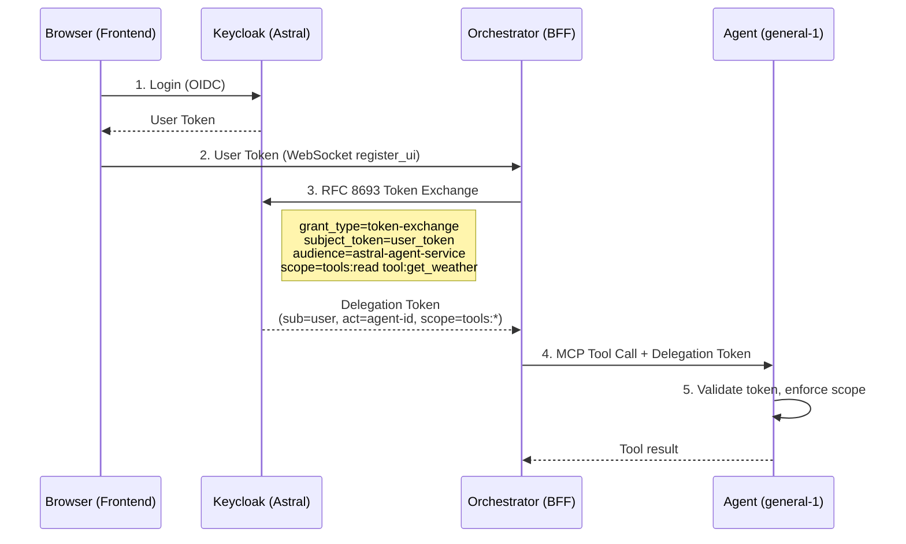

# Keycloak Agent Delegation Setup Guide

> **Keycloak 26.2+** · **RFC 8693 — OAuth 2.0 Token Exchange**
> https://datatracker.ietf.org/doc/html/rfc8693

Keycloak 26.2 introduced **Standard Token Exchange V2** as a fully supported feature (no longer preview). The old "Permissions" tab is removed — configuration is now a simple toggle in client settings.

---

## Why This Matters: The Delegated Authority Framework

This setup enables the **Delegated Authority Framework (DAF)** — the security layer that prevents Tool Poisoning Attacks from escalating. Instead of forwarding the user's full-access token to agents (impersonation), the orchestrator exchanges it for a **narrowly-scoped delegation token** with:

- **`act` claim** — Identifies the agent as the actor (not the user), enabling audit trails
- **Attenuated scopes** — Only the permissions needed for the current task (e.g., `tools:read tool:get_weather`)
- **Short expiry** — 5-minute lifetime limits the window of exposure
- **Blast radius containment** — A compromised tool can only access what the delegation token permits

---

## Prerequisites

- Admin access to the **Astral** realm at `https://iam.ai.uky.edu`
- The `astral-frontend` client already exists and is configured for OIDC
- Keycloak **26.2.3** or later

---

## Step 1: Enable Token Exchange on `astral-frontend`

1. Navigate to: **Clients → `astral-frontend` → Settings**
2. Scroll to **Capability config**
3. Enable: ✅ **OAuth 2.0 Token Exchange**

   > This is the new V2 toggle introduced in Keycloak 26.2. It replaces the old preview feature that required the Permissions tab + fine-grained admin authz.

4. Click **Save**

> [!NOTE]
> If the toggle is not visible, verify your Keycloak version is 26.2+. For 26.0.x, you would need the legacy approach with `--features=token-exchange,admin-fine-grained-authz` startup flags, but those are deprecated.

---

## Step 2: Create the Agent Service Account Client

This confidential client represents the "agent actor" in the delegation flow.

1. **Clients → Create client**
2. Configure:

   | Setting | Value |
   |---------|-------|
   | Client ID | `astral-agent-service` |
   | Name | `AstralDeep Agent Service` |
   | Client authentication | **ON** (confidential) |
   | Authorization | OFF |
   | Standard flow | OFF |
   | Direct access grants | OFF |
   | Service accounts roles | **ON** |

3. Click **Save**
4. Go to the **Credentials** tab → copy the **Client secret**
5. Add this secret to your `.env` file:
   ```
   AGENT_SERVICE_CLIENT_ID=astral-agent-service
   AGENT_SERVICE_CLIENT_SECRET=<paste-secret-here>
   ```

---

## Step 3: Enable Token Exchange on Agent Service Client

1. Navigate to: **Clients → `astral-agent-service` → Settings**
2. Scroll to **Capability config**
3. Enable: ✅ **OAuth 2.0 Token Exchange**
4. Click **Save**

## Step 4: Add Audience Mapper to `astral-frontend`

Keycloak needs to know that `astral-agent-service` is a valid audience target for token exchange from `astral-frontend`.

1. Navigate to: **Clients → `astral-frontend` → Client scopes** tab
2. Click on **`astral-frontend-dedicated`** (the dedicated scope)
3. Go to **Mappers** → **Configure a new mapper** → **Audience**
4. Configure:

   | Setting | Value |
   |---------|-------|
   | Name | `agent-service-audience` |
   | Included Client Audience | **`astral-agent-service`** |
   | Add to ID token | OFF |
   | Add to access token | **ON** |

5. Click **Save**

> [!CAUTION]
> Without this mapper, token exchange will fail with `"Requested audience not available: astral-agent-service"`.

---

## Step 5: Verify Token Exchange is Enabled

With Keycloak 26.2 Standard Token Exchange V2, enabling the toggle on both clients (Steps 1 and 3) is the complete setup. No additional policies or permissions are required.

**Quick check:**
1. **Clients → `astral-frontend`** → Settings → Capability config → "OAuth 2.0 Token Exchange" = ✅
2. **Clients → `astral-agent-service`** → Settings → Capability config → "OAuth 2.0 Token Exchange" = ✅

> [!NOTE]
> Unlike older Keycloak versions, V2 does not require Client Policies or fine-grained admin permissions for token exchange. The toggle is all you need.

---

## Step 6: Add `act` (Actor) Claim Mapper

Per RFC 8693 §4.1, delegation tokens should include the `act` claim identifying the agent actor.

1. Go to: **Client scopes → Create client scope**

   | Setting | Value |
   |---------|-------|
   | Name | `agent-delegation` |
   | Description | `Adds delegation claims for agent token exchange` |
   | Type | **Optional** |
   | Protocol | `openid-connect` |

2. Inside the new `agent-delegation` scope → **Mappers** tab → **Configure a new mapper** → **Hardcoded claim**:

   | Setting | Value |
   |---------|-------|
   | Name | `actor-claim` |
   | Token Claim Name | `act` |
   | Claim value | `{}` |
   | Claim JSON type | `JSON` |
   | Add to ID token | OFF |
   | Add to access token | **ON** |
   | Add to userinfo | OFF |

   > [!NOTE]
   > The empty `{}` is a placeholder. The actual `act.sub` value is populated dynamically by the orchestrator backend when performing the token exchange.

3. Go to: **Clients → `astral-agent-service` → Client scopes** tab
4. Click **Add client scope** → select `agent-delegation` → add as **Optional**

---

## Step 7: Create and Assign Tool Scopes

The orchestrator requests scope-level claims in the token exchange (the set is
`tool_permissions.VALID_SCOPES`). Each requested scope must (a) exist as a client
scope and (b) be assigned to the **requesting** client, or the exchange fails
`invalid_scope: Invalid scopes: ...`.

1. **Client scopes → Create client scope** for each (Protocol `openid-connect`,
   Type `Optional`, **Include in token scope** ON):

   | Scope Name | Description |
   |------------|-------------|
   | `tools:read` | Read-only tools (system status, search, charts) |
   | `tools:write` | Data-modifying tools (modify_data) |
   | `tools:search` | Search tools (Wikipedia, arXiv) |
   | `tools:system` | System information tools |
   | `tools:files` | File/volume access tools (general agent file readers) |
   | `tools:execute` | Command-execution tools (run_command, run_shell) |

2. Assign all six to **BOTH** clients as **Optional**:
   - **Clients → `astral-frontend` → Client scopes → Add client scope** —
     **REQUIRED.** Keycloak validates the token-exchange `scope` parameter
     against the *requesting* client, and the orchestrator authenticates the
     exchange as `astral-frontend` (`KEYCLOAK_CLIENT_ID`). Assigning the scopes
     only to `astral-agent-service` is **not** enough — that is the most common
     cause of `invalid_scope` after everything else looks correct.
   - **Clients → `astral-agent-service` → Client scopes → Add client scope** —
     the audience/actor client.

> [!IMPORTANT]
> Assign the scopes to `astral-frontend`, not only `astral-agent-service`. A user
> who has never enabled a per-agent scope may exchange with an empty scope (which
> succeeds), but the moment any tool scope is requested Keycloak rejects it unless
> `astral-frontend` carries that scope. The native login clients
> (`astral-mobile`/`astral-desktop`/`astral-watch`) do **not** need these scopes —
> they never perform the exchange; only the confidential `astral-frontend` client
> does.

> [!TIP]
> The orchestrator's tool permission system (the UI toggle) provides
> **fine-grained per-tool control** on top of these coarse scope categories. The
> Keycloak scopes are the outer security boundary; the UI toggles are the inner
> one. In production posture both must allow a tool for it to run.

---

## Step 8: Verify the Setup

### Test Token Exchange

```bash
# 1. Get a user token first (via existing login flow)
USER_TOKEN="<paste-user-access-token>"

# 2. Exchange it for a delegation token
curl -X POST "https://iam.ai.uky.edu/realms/Astral/protocol/openid-connect/token" \
  -H "Content-Type: application/x-www-form-urlencoded" \
  -d "grant_type=urn:ietf:params:oauth:grant-type:token-exchange" \
  -d "client_id=astral-frontend" \
  -d "client_secret=<astral-frontend-client-secret>" \
  -d "subject_token=$USER_TOKEN" \
  -d "subject_token_type=urn:ietf:params:oauth:token-type:access_token" \
  -d "requested_token_type=urn:ietf:params:oauth:token-type:access_token" \
  -d "audience=astral-agent-service"
```

### Expected Response

```json
{
  "access_token": "eyJhbGciOi...",
  "token_type": "Bearer",
  "expires_in": 300,
  "issued_token_type": "urn:ietf:params:oauth:token-type:access_token"
}
```

### Decode & Verify

Paste the `access_token` at [jwt.io](https://jwt.io) and verify:
- `sub` = the original user's ID
- `azp` = `astral-frontend`
- `aud` = includes `astral-agent-service`

---

## Token Flow Diagram



---

## Environment Variables

Add these to your `.env` file after completing the setup:

```env
# Agent Delegation (RFC 8693)
AGENT_SERVICE_CLIENT_ID=astral-agent-service
AGENT_SERVICE_CLIENT_SECRET=<from-step-2>
```

The existing variables remain unchanged:
```env
KEYCLOAK_AUTHORITY=https://iam.ai.uky.edu/realms/Astral
KEYCLOAK_CLIENT_ID=astral-frontend
KEYCLOAK_CLIENT_SECRET=<astral-frontend-client-secret>
```
(The React-era `VITE_KEYCLOAK_*` names are deprecated aliases, backfilled
automatically by `backend/shared/__init__.py` — use the un-prefixed names.)

---

## Troubleshooting

| Issue | Cause | Fix |
|-------|-------|-----|
| Token exchange toggle not visible | Keycloak < 26.2 | Upgrade to 26.2+, or use legacy `--features=token-exchange` |
| `"error": "not_allowed"` | Exchange not enabled on client | Verify Steps 1 and 3 — toggle on both clients |
| `"error": "invalid_client"` | Wrong client secret | Check `AGENT_SERVICE_CLIENT_SECRET` in `.env` |
| `"error": "invalid_scope"` (`Invalid scopes: tools:...`) | Requested `tools:*` scope not assigned to the **requesting** client | Assign the scope to **`astral-frontend`** (Step 7), not just `astral-agent-service` |
| `"error": "invalid_token"` | Expired user token | Refresh the user token before exchanging |
| Missing `act` claim | Mapper not configured | Verify Step 6 — `actor-claim` mapper on `agent-delegation` scope |
| `"error": "access_denied"` | Exchange/audience misconfigured | Re-check Steps 1–4 (exchange toggles + audience mapper); V2 needs no client policies (Step 5) |
