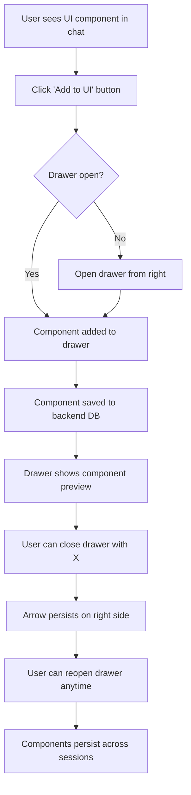

# UI Drawer Implementation Plan

## Overview
Implement a "Add to UI" feature that allows users to save UI components from chat responses into a persistent drawer. The drawer slides in from the right, covers 75% of the chat area, and can be reopened via a persistent arrow on the right side of the chat window.

## Architecture

### 1. Database Schema Additions
```sql
-- Saved UI components table
CREATE TABLE IF NOT EXISTS saved_components (
    id TEXT PRIMARY KEY,
    chat_id TEXT NOT NULL,
    component_data TEXT NOT NULL,  -- JSON serialized component
    component_type TEXT NOT NULL,
    title TEXT,
    created_at INTEGER,
    FOREIGN KEY (chat_id) REFERENCES chats (id) ON DELETE CASCADE
);

-- Add has_saved_components flag to chats table
ALTER TABLE chats ADD COLUMN has_saved_components BOOLEAN DEFAULT 0;
```

### 2. Backend Changes

#### New Message Types in Protocol:
- `save_component`: Save a UI component to the drawer
- `get_saved_components`: Retrieve saved components for a chat
- `delete_saved_component`: Remove a component from the drawer
- `saved_components_list`: Response with saved components

#### New HistoryManager Methods:
- `save_component(chat_id, component_data)`: Save component to DB
- `get_saved_components(chat_id)`: Retrieve all saved components for chat
- `delete_component(component_id)`: Remove specific component
- `update_chat_has_components_flag(chat_id)`: Update flag when components added/removed

#### Orchestrator WebSocket Handlers:
- Handle `ui_event` with action `save_component`
- Handle `ui_event` with action `get_saved_components`
- Handle `ui_event` with action `delete_saved_component`
- Broadcast updates to UI when components change

### 3. Frontend Changes

#### New Components:
1. **Drawer Component** (`UISavedDrawer.tsx`):
   - Slides in from right covering 75% of chat area
   - Contains close (X) button and persistent arrow for reopening
   - Grid layout for saved components
   - Each component is interactive (same as in chat)

2. **Component Save Button** (`ComponentSaveButton.tsx`):
   - "Add to UI" button on top right of each component
   - Changes to "Added" state after saving
   - Tooltip on hover

3. **Chat History Indicator**:
   - Icon next to chat history items that have saved components
   - Tooltip shows "Contains saved UI components"

#### State Management:
- New hook `useSavedComponents()`:
  - Manages local state of saved components
  - Syncs with backend via WebSocket
  - Handles adding/removing components

#### Integration Points:
1. **DynamicRenderer**: Wrap each rendered component with save button
2. **ChatInterface**: Add drawer toggle arrow on right side
3. **DashboardLayout**: Pass saved components to chat history items
4. **useWebSocket**: Handle new message types for component persistence

### 4. User Flow


### 5. Technical Implementation Details

#### Component Identification:
- Each component gets a unique ID when rendered
- Save button passes component JSON data to save function
- Nested components (containers, cards) can be saved as whole or individually

#### Drawer Animation:
- Use Framer Motion for slide-in animation
- Position: fixed, right: 0, width: 75%, height: 100%
- Z-index above chat but below modals

#### Persistence:
- Components stored as JSON in SQLite
- Serialized using existing `to_json()` methods
- Deserialized using `Component.from_json()` when loading

#### Performance Considerations:
- Virtual scrolling for many saved components
- Debounced save operations
- Component previews (thumbnails) for large components

### 6. Files to Create/Modify

#### Backend:
- `backend/shared/database.py`: Add new table schema
- `backend/orchestrator/history.py`: Add component management methods
- `backend/shared/protocol.py`: Add new message types
- `backend/orchestrator/orchestrator.py`: Add WebSocket handlers

#### Frontend:
- `frontend/src/components/UISavedDrawer.tsx`: New drawer component
- `frontend/src/components/ComponentSaveButton.tsx`: New save button
- `frontend/src/hooks/useSavedComponents.ts`: New hook
- `frontend/src/components/DynamicRenderer.tsx`: Modify to add save buttons
- `frontend/src/components/ChatInterface.tsx`: Add drawer toggle
- `frontend/src/components/DashboardLayout.tsx`: Add history indicators
- `frontend/src/hooks/useWebSocket.ts`: Add new message handlers

### 7. Testing Strategy
1. Unit tests for component serialization/deserialization
2. Integration tests for save/load flow
3. E2E test with actual UI components (charts, tables, etc.)
4. Performance test with many saved components

### 8. Success Metrics
- Components save successfully to database
- Drawer opens/closes smoothly
- Saved components remain interactive
- Persistence works across browser sessions
- Performance with 50+ saved components

## Next Steps
1. Implement database schema changes
2. Create backend API endpoints
3. Build frontend drawer component
4. Add save buttons to DynamicRenderer
5. Implement state management and persistence
6. Test complete flow
7. Deploy and gather feedback

## Estimated Complexity
- **Backend**: Medium (database changes, new WebSocket handlers)
- **Frontend**: High (new components, state management, animations)
- **Integration**: Medium (coordination between frontend/backend)
- **Testing**: Medium (requires comprehensive UI testing)

## Risks & Mitigations
- **Performance with many components**: Implement virtual scrolling, component limits
- **Component compatibility**: Ensure all component types can be serialized
- **State synchronization**: Use optimistic updates with rollback on error
- **Backward compatibility**: Ensure existing chats work without modification