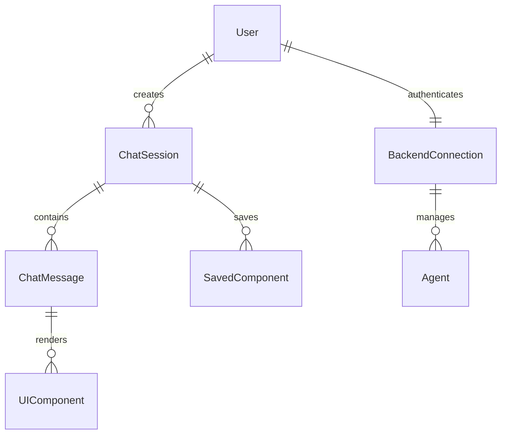

# Data Model: Flutter Real Authentication Implementation

**Date**: 2026-02-27  
**Branch**: `002-flutter-real-auth`  
**Source**: Feature specification and React frontend implementation

## Overview

This document defines the data models required to implement the Flutter frontend with parity to the React frontend. All models must match the structure used by the backend API and React components.

## Core Entities

### 1. User
Represents an authenticated user via OIDC/Keycloak.

**Fields**:
```dart
class User {
  String id;           // OIDC subject (sub)
  String email;
  String name;
  List<String> roles;  // ['user', 'admin']
  String? pictureUrl;
  DateTime? createdAt;
  
  // Authentication tokens
  String accessToken;
  String refreshToken;
  DateTime accessTokenExpiry;
  
  // Derived properties
  bool get isAuthenticated => accessToken.isNotEmpty;
  bool get isAdmin => roles.contains('admin');
}
```

**Validation rules from React frontend**:
- Email must match regex: `^[^\s@]+@[^\s@]+\.[^\s@]+\.?`
- Name must be 2-100 characters
- Roles must be subset of ['user', 'admin', 'viewer']

**Storage**:
- Tokens in `flutter_secure_storage`
- User profile in `shared_preferences` (non-sensitive data)

### 2. ChatSession
Represents a conversation with the orchestrator.

**Fields**:
```dart
class ChatSession {
  String id;           // UUID
  String title;        // Auto-generated from first message
  List<ChatMessage> messages;
  List<SavedComponent> savedComponents;
  DateTime createdAt;
  DateTime updatedAt;
  
  // Metadata
  bool isArchived;
  String? agentId;     // Primary agent for this session
  Map<String, dynamic> metadata; // Custom fields
}
```

**State transitions**:
1. `created` → `active` (first message sent)
2. `active` → `archived` (user archives)
3. `archived` → `active` (user restores)

**Validation**:
- Title auto-generated: First 50 chars of first message + "..."
- Maximum 1000 messages per session (backend limit)

### 3. ChatMessage
Individual message in a chat session.

**Fields**:
```dart
class ChatMessage {
  String id;
  String sessionId;
  MessageRole role;    // user, assistant, system, tool
  String content;      // Text content or JSON for UI components
  List<UIComponent> components; // Parsed UI components
  DateTime timestamp;
  
  // Status for tool execution
  MessageStatus status; // sending, sent, delivered, error
  String? errorMessage;
  
  // Metadata
  Map<String, dynamic> metadata;
}

enum MessageRole { user, assistant, system, tool }
enum MessageStatus { sending, sent, delivered, error }
```

**Validation from React**:
- Content max length: 10,000 characters
- Tool messages must have `metadata['tool_name']` and `metadata['tool_result']`

### 4. UIComponent
Renderable UI primitive from backend specification.

**Base class**:
```dart
abstract class UIComponent {
  String type;  // text, card, table, metric, alert, progress, grid, list, 
                // code, bar_chart, line_chart, pie_chart, plotly_chart, 
                // divider, button, collapsible, file_upload, file_download
  String id;
  Map<String, dynamic> properties;
  Map<String, dynamic> style; // CSS-like styling
}
```

**Concrete implementations** (partial list):
```dart
class TextComponent extends UIComponent {
  final String text;
  final TextStyleStyle? textStyle; // Flutter TextStyle equivalent
}

class CardComponent extends UIComponent {
  final String title;
  final String? subtitle;
  final List<UIComponent> children;
  final EdgeInsets padding;
}

class TableComponent extends UIComponent {
  final List<String> columns;
  final List<List<String>> rows;
  final bool paginated;
  final int pageSize;
}

class ChartComponent extends UIComponent {
  final ChartType chartType; // bar, line, pie, plotly
  final List<ChartDataPoint> data;
  final ChartOptions options;
}
```

**Styling mapping** (React CSS → Flutter):
- `margin: 16px` → `EdgeInsets.all(16)`
- `padding: 8px 12px` → `EdgeInsets.symmetric(horizontal: 12, vertical: 8)`
- `border-radius: 8px` → `BorderRadius.circular(8)`
- `color: #3b82f6` → `Color(0xFF3b82f6)`
- `font-size: 14px` → `fontSize: 14`

### 5. SavedComponent
UI component saved from chat responses.

**Fields**:
```dart
class SavedComponent {
  String id;
  String title;        // User-provided or auto-generated
  UIComponent component;
  String sourceSessionId;
  String sourceMessageId;
  DateTime savedAt;
  List<String> tags;
  
  // Usage statistics
  int viewCount;
  DateTime lastUsedAt;
}
```

**Operations**:
- **Combine**: Merge multiple components into one via LLM
- **Condense**: Reduce multiple components to fewer cohesive components
- **Delete**: Remove from storage
- **Export**: Share as JSON

### 6. BackendConnection
Connection state to the Python orchestrator.

**Fields**:
```dart
class BackendConnection {
  String wsUrl;        // ws://localhost:8001/ws
  ConnectionStatus status; // connecting, connected, disconnected, error
  DateTime? lastConnectedAt;
  int reconnectAttempts;
  String? errorMessage;
  
  // Agent information
  List<Agent> availableAgents;
  String? activeAgentId;
}

enum ConnectionStatus { connecting, connected, disconnected, error }
```

### 7. Agent
AI agent available through the orchestrator.

**Fields**:
```dart
class Agent {
  String id;
  String name;
  String description;
  AgentStatus status;  // online, offline, busy
  List<String> capabilities; // ['chat', 'file_analysis', 'code_generation']
  
  // Performance metrics
  double averageResponseTime;
  int totalRequests;
}

enum AgentStatus { online, offline, busy }
```

## Relationships



## Data Flow

1. **Authentication**: User → OIDC → Tokens → BackendConnection
2. **Chat**: User → ChatMessage → WebSocket → Backend → UIComponent
3. **Persistence**: ChatSession → Local DB, SavedComponent → Hive
4. **Sync**: Periodic sync of chat history with backend (optional)

## Validation Rules

### From React Frontend
1. **Message validation**:
   - Empty messages rejected
   - File attachments must be <10MB
   - Rate limit: 5 messages per minute

2. **Component validation**:
   - UIComponent JSON must match backend schema
   - Unknown component types fallback to text display
   - Style properties must be sanitized (no script injection)

3. **User validation**:
   - Email verification required for certain actions
   - Admin role required for agent management

### From Backend API
1. **WebSocket messages**:
   - Must include `type` and `data` fields
   - `register_ui` requires valid JWT
   - `ui_event` must have session_id

2. **File upload**:
   - CSV files limited to 10,000 rows
   - Text files limited to 1MB
   - Supported MIME types: text/csv, application/json, text/plain, text/markdown

## Storage Strategy

### Local Storage
- **Hive**: ChatSession, SavedComponent, UIComponent cache
- **Shared Preferences**: User preferences, app settings
- **Secure Storage**: OIDC tokens, encryption keys

### Remote Storage (Backend)
- **PostgreSQL**: Chat history, user profiles, component metadata
- **File system**: Uploaded files, generated reports

### Sync Mechanism
- Real-time via WebSocket for active sessions
- Background sync for offline changes
- Conflict resolution: Last write wins for non-critical data

## Migration from React

### Data Model Mapping
| React Interface | Flutter Model | Notes |
|----------------|---------------|-------|
| `UserProfile` | `User` | Same fields, different serialization |
| `ChatSession` | `ChatSession` | Identical structure |
| `Message` | `ChatMessage` | Role enum matches |
| `UIComponent` | `UIComponent` | JSON schema identical |
| `SavedComponent` | `SavedComponent` | Same operations |

### Serialization/Deserialization
- Use `json_serializable` with same field names as React
- Maintain backward compatibility with backend API
- Test with actual backend responses

## Performance Considerations

1. **Lazy loading**: Load chat messages paginated (50 per page)
2. **Caching**: UIComponent rendering cache with LRU eviction
3. **Database indexing**: Hive indexes on `sessionId`, `savedAt`
4. **Memory management**: Dispose controllers, close streams

## Security

1. **Token storage**: Use `flutter_secure_storage` with biometric protection
2. **Input sanitization**: Sanitize HTML in text components
3. **Network security**: TLS for WebSocket (wss://), certificate pinning
4. **Data encryption**: Encrypt sensitive data in Hive

---

*This data model ensures parity with React frontend while adapting to Flutter's type system and storage capabilities. All models are ready for implementation in Phase 2.*
